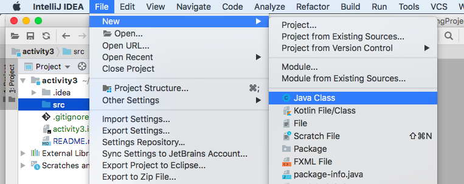
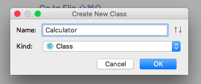
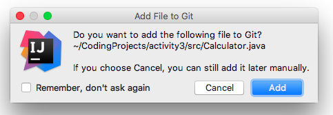
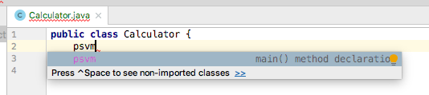
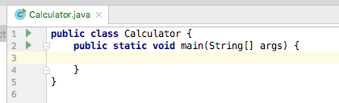

# Section 3 Activity

In this assignment, we will work with the video lesson 3.6 to create a Calculator program. This will serve an exercise for using Java I/O again, as well as a tutorial for how to work with Java operators and control structures.

Although the video is using DrJava and you will be working in IntelliJ IDEA I think you will find that it is easy to follow along. To create the Calculator class follow these steps in Intellij.

## Project setup:

Please open the Project tab and click on the name of the project. This should be named ```section-3-activity-``` followed by your GitHub username.

1. Click File → New... → Directory
2. Enter ```src``` as the name of the new directory.

## Create the Calculator class file

1. Click on the ```src``` folder. This is where your Calculator class will be added.
2. File → New... → Class...

 
3. Specify the name as 'Calculator' (remember that class names should be uppercase)

 
4. Add your class to git

 
5. Create a main method by typing psvm and hitting tab

 

You are ready to start, your class should look like:



## Complete the activity

Following the steps as described in the video, make sure your calculator will:

1. Ask the user what calculation they want to complete: add, subtract, multiply or divide
2. Ask the user two numbers to calculate
3. Have the computer do the calculation
4. Have the computer print out the result of their calculation.
5. Ask the user if they want to perform another calculation or not -- this isn’t covered in the video directly, but the concept of how to do it should be fairly straightforward.
6. If the user wants to run it again, they should press 1, and the program should repeat.
7. If they do not want to, then they press 2, then the program should terminate.

If you need a refresher on any of the topics being covered, you can always go back to the relevant video where the topic is discussed.

~~Remember that it’s best to save often when writing code in case anything happens!~~
When using IntelliJ IDEA your code is saved for you frequently. Remember to use good commit messages when committing your changes and push the code to GitHub in case your laptop catches fire.

## Rubric

Your Section 3 Assignment will be graded according to the following:

If this table is not legible, please view on GitHub or install the [gfm plugin](https://plugins.jetbrains.com/plugin/7701-gfm).

| Rubric | 10 possible points |
| ------ | ------------------ |
| +1 | Program asks the user what calculation they want to complete: add, subtract, multiply or divide - input is stored in variable. |
| +1 | Program asks the user for two numbers to calculate - these are stored in variables |
| +1 | Program calculates result and stores in variable |
| +1 | Program outputs result of calculation |
| +1 | Program asks the user if they want to perform another calculation, 1 for yes, 2 for no |
| +1 | If the user presses 1, the program starts all over. |
| +1 | If the user presses 2, the program ends with a pause (Press any key to continue). |
| +1 | Code compiles correctly |
| +1 | Program executes as directed |
| +1 | Program turned in through GitHub Classroom |
